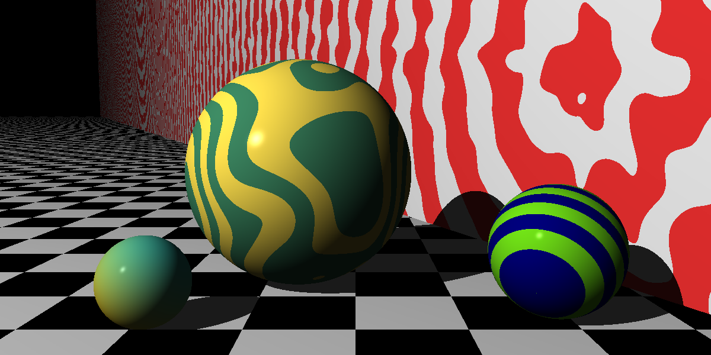
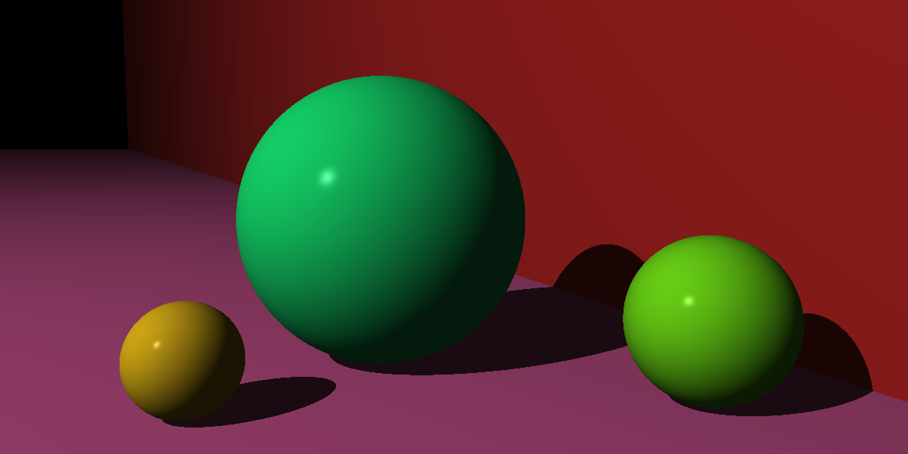
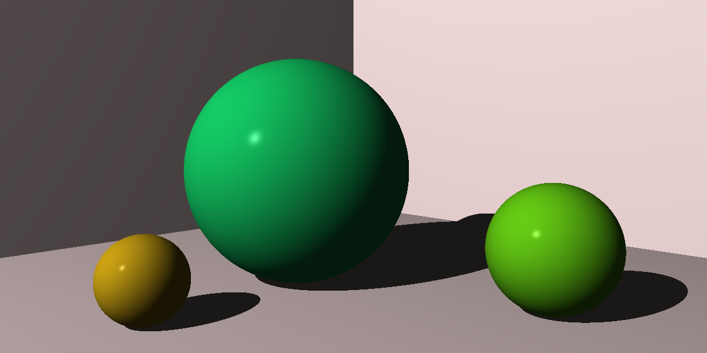
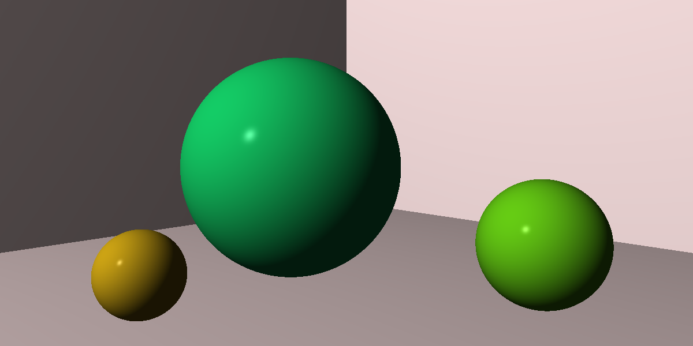
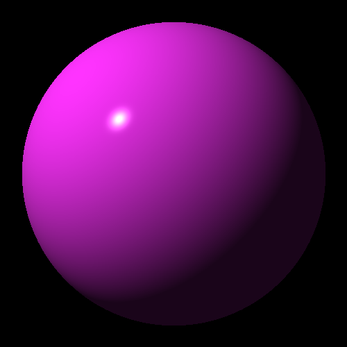

# Ray Tracer Challenge
This is a ray tracer built in Rust following the book ["The ray tracer challenge" by Jamis Buck](http://raytracerchallenge.com/).

My objectives with this project is to
* Learn about 3D graphics
* Learn Rust

## Examples
### Chapter 10, Patterns

### Chapter 9, Planes

### Chapter 8, Shadows

### Chapter 7, Scene made from multiple spheres 

### Chapter 6, First 3D sphere

