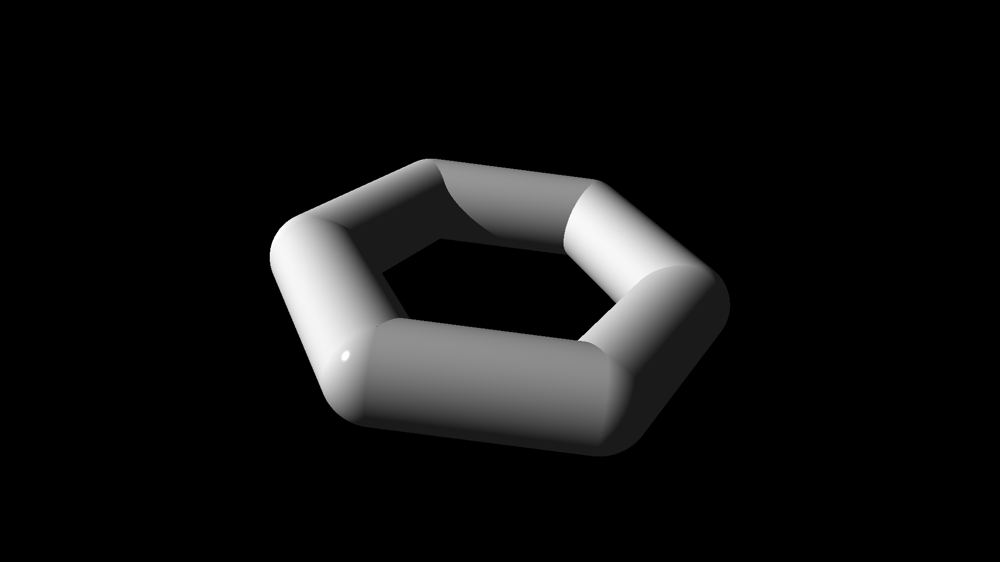

# Ray Tracer Challenge


This is a ray tracer written in Rust following the book ["The ray tracer challenge" by Jamis Buck](http://raytracerchallenge.com/). 

The book provides language agnostic test cases, pseudocode and explanations. The rest is up to the reader to implement.
### What is ray tracing?
Ray tracing is a technique for rendering digital images by simulating how light behaves as it interacts with different materials. It produces realistic results but is relatively slow.

[Ray Tracing (Wikipedia)](https://en.wikipedia.org/wiki/Ray_tracing_(graphics))

### Why?
My objectives with this project is to
* Learn about 3D graphics
* Learn Rust

## Run
```sh
cargo run --release
```

## Examples

### Chapter 15, Triangles


### Chapter 14, Groups


### Chapter 13, Cylinders and Cones


### Chapter 12, Cubes


### Chapter 11, Reflection and Refraction


### Chapter 10, Patterns


### Chapter 9, Planes


### Chapter 8, Shadows


### Chapter 7, Scene made from multiple spheres


### Chapter 6, First 3D sphere

